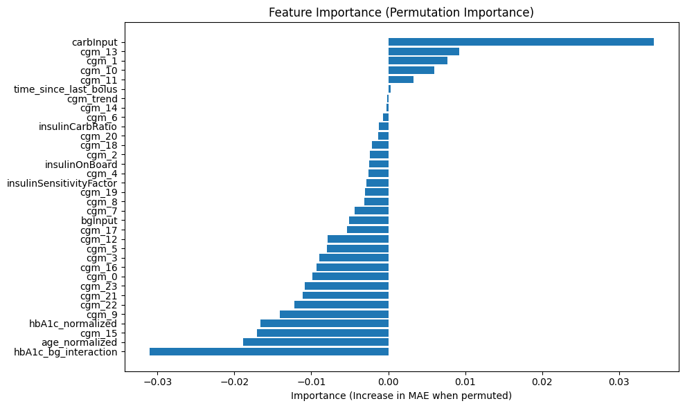
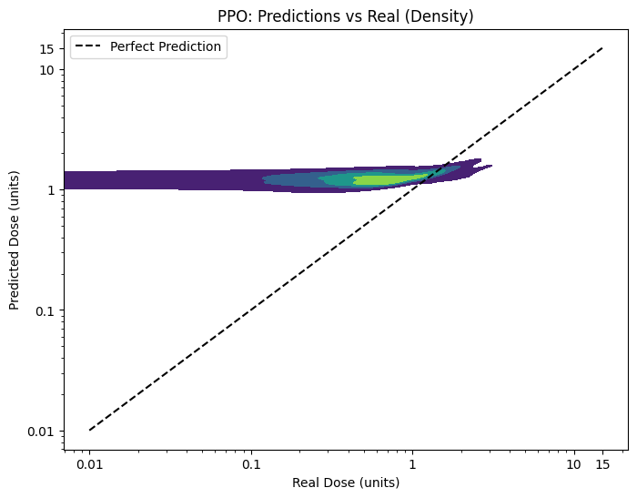
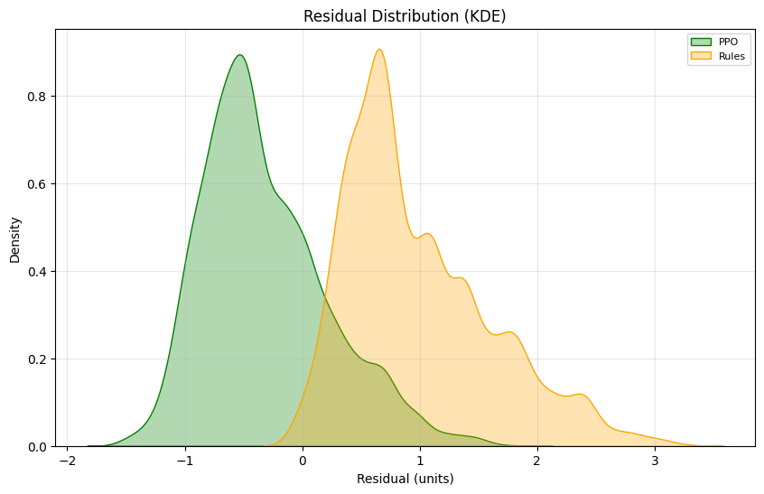
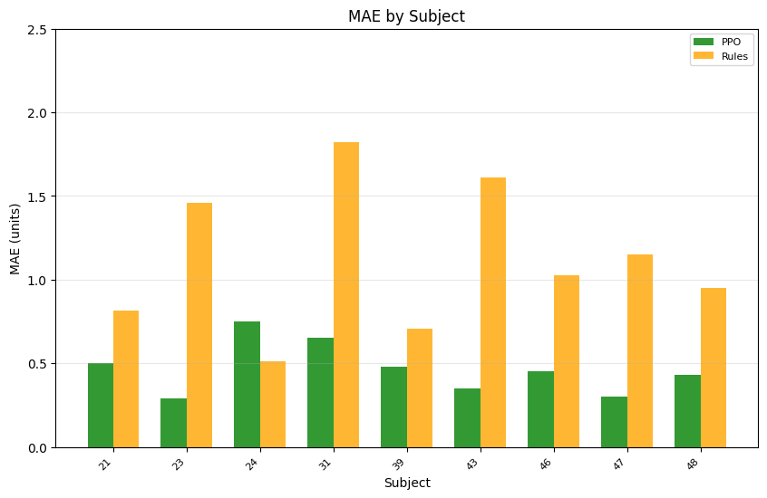

# Experiment Report: drl_insulin_dose_report
Generated: 2025-04-09 10:15:47

# Data Processing
```python
Starting data processing and preparation...
Metadata after cleaning:
shape: (5, 6)
┌────────────┬────────────────┬────────┬──────┬───────┬──────────────────┐
│ subject_id ┆ age_normalized ┆ gender ┆ race ┆ hbA1c ┆ hbA1c_normalized │
│ ---        ┆ ---            ┆ ---    ┆ ---  ┆ ---   ┆ ---              │
│ i64        ┆ f64            ┆ f64    ┆ f64  ┆ f64   ┆ f64              │
╞════════════╪════════════════╪════════╪══════╪═══════╪══════════════════╡
│ 0          ┆ 0.018182       ┆ 1.0    ┆ 1.0  ┆ 6.3   ┆ 0.2875           │
│ 1          ┆ 0.036364       ┆ 0.0    ┆ 1.0  ┆ 9.9   ┆ 0.7375           │
│ 2          ┆ 0.0            ┆ 0.0    ┆ 1.0  ┆ 8.3   ┆ 0.5375           │
│ 3          ┆ 0.127273       ┆ 0.0    ┆ 1.0  ┆ 7.2   ┆ 0.4              │
│ 4          ┆ 0.163636       ┆ 1.0    ┆ 1.0  ┆ 8.6   ┆ 0.575            │
└────────────┴────────────────┴────────┴──────┴───────┴──────────────────┘

Found Subject files (54):
Subject1.xlsx
Subject10.xlsx
Subject11.xlsx
Subject12.xlsx
Subject13.xlsx
Subject14.xlsx
Subject15.xlsx
Subject16.xlsx
Subject17.xlsx
Subject18.xlsx
Subject19.xlsx
Subject2.xlsx
Subject20.xlsx
Subject21.xlsx
Subject22.xlsx
Subject23.xlsx
Subject24.xlsx
Subject25.xlsx
Subject26.xlsx
Subject27.xlsx
Subject28.xlsx
Subject29.xlsx
Subject3.xlsx
Subject30.xlsx
Subject31.xlsx
Subject32.xlsx
Subject33.xlsx
Subject34.xlsx
Subject35.xlsx
Subject36.xlsx
Subject37.xlsx
Subject38.xlsx
Subject39.xlsx
Subject4.xlsx
Subject40.xlsx
Subject41.xlsx
Subject42.xlsx
Subject43.xlsx
Subject44.xlsx
Subject45.xlsx
Subject46.xlsx
Subject47.xlsx
Subject48.xlsx
Subject49.xlsx
Subject5.xlsx
Subject50.xlsx
Subject51.xlsx
Subject52.xlsx
Subject53.xlsx
Subject54.xlsx
Subject6.xlsx
Subject7.xlsx
Subject8.xlsx
Subject9.xlsx
Muestra de datos procesados combinados:
shape: (5, 15)
┌────────────┬─────────────────────────────────┬────────┬───────────┬───┬────────────────┬────────┬──────────────────┬──────────────────────┐
│ subject_id ┆ cgm_window                      ┆ normal ┆ carbInput ┆ … ┆ age_normalized ┆ gender ┆ hbA1c_normalized ┆ hbA1c_bg_interaction │
│ ---        ┆ ---                             ┆ ---    ┆ ---       ┆   ┆ ---            ┆ ---    ┆ ---              ┆ ---                  │
│ i64        ┆ object                          ┆ f64    ┆ f64       ┆   ┆ f64            ┆ f64    ┆ f64              ┆ f64                  │
╞════════════╪═════════════════════════════════╪════════╪═══════════╪═══╪════════════════╪════════╪══════════════════╪══════════════════════╡
│ 21         ┆ [210.8174087  198.82779304 196… ┆ 1.5    ┆ 20.0      ┆ … ┆ 0.072727       ┆ 0.0    ┆ 0.35             ┆ 77.982459            │
│ 21         ┆ [162.85894606 167.85461925 176… ┆ 2.0    ┆ 20.0      ┆ … ┆ 0.072727       ┆ 0.0    ┆ 0.35             ┆ 91.270949            │
│ 21         ┆ [256.77760207 257.7767367  260… ┆ 2.0    ┆ 20.0      ┆ … ┆ 0.072727       ┆ 0.0    ┆ 0.35             ┆ 108.755805           │
│ 21         ┆ [320.72221892 319.72308428 317… ┆ 3.0    ┆ 20.0      ┆ … ┆ 0.072727       ┆ 0.0    ┆ 0.35             ┆ 86.375189            │
│ 21         ┆ [113.90134878 112.90221414 111… ┆ 1.0    ┆ 20.0      ┆ … ┆ 0.072727       ┆ 0.0    ┆ 0.35             ┆ 31.123044            │
└────────────┴─────────────────────────────────┴────────┴───────────┴───┴────────────────┴────────┴──────────────────┴──────────────────────┘
Total de muestras: 8649
Schema de df_processed:
Schema([('subject_id', Int64), ('cgm_window', Object), ('normal', Float64), ('carbInput', Float64), ('bgInput', Float64), ('insulinOnBoard', Float64), ('insulinCarbRatio', Float64), ('insulinSensitivityFactor', Float64), ('hour_of_day', Float64), ('time_since_last_bolus', Float64), ('cgm_trend', Float64), ('age_normalized', Float64), ('gender', Float64), ('hbA1c_normalized', Float64), ('hbA1c_bg_interaction', Float64)])
Verificación de NaN en df_final:
shape: (1, 38)
┌───────┬───────┬───────┬───────┬───┬────────────────┬────────┬──────────────────┬──────────────────────┐
│ cgm_0 ┆ cgm_1 ┆ cgm_2 ┆ cgm_3 ┆ … ┆ age_normalized ┆ gender ┆ hbA1c_normalized ┆ hbA1c_bg_interaction │
│ ---   ┆ ---   ┆ ---   ┆ ---   ┆   ┆ ---            ┆ ---    ┆ ---              ┆ ---                  │
│ u32   ┆ u32   ┆ u32   ┆ u32   ┆   ┆ u32            ┆ u32    ┆ u32              ┆ u32                  │
╞═══════╪═══════╪═══════╪═══════╪═══╪════════════════╪════════╪══════════════════╪══════════════════════╡
│ 0     ┆ 0     ┆ 0     ┆ 0     ┆ … ┆ 0              ┆ 0      ┆ 0                ┆ 0                    │
└───────┴───────┴───────┴───────┴───┴────────────────┴────────┴──────────────────┴──────────────────────┘
Preprocesamiento completo en 40.34 segundos
```
# Cross-Validation and Model Training
```python
Fold 1 - Post-split Train y: mean = 1.44, std = 0.60
Fold 1 - Post-split Val y: mean = 1.30, std = 0.48
Fold 1 - Post-split Test y: mean = 0.99, std = 0.62
Fold 1 - Entrenamiento CGM: (2125, 24, 1), Validación CGM: (540, 24, 1), Prueba CGM: (5984, 24, 1)
Fold 1 - Entrenamiento Otros: (2125, 10), Validación Otros: (540, 10), Prueba Otros: (5984, 10)
Fold 1 - Sujetos de prueba: [21 23 24 31 39 43 46 47 48]
Fold 2 - Post-split Train y: mean = 0.98, std = 0.62
Fold 2 - Post-split Val y: mean = 1.15, std = 0.48
Fold 2 - Post-split Test y: mean = 1.41, std = 0.58
Fold 2 - Entrenamiento CGM: (5812, 24, 1), Validación CGM: (172, 24, 1), Prueba CGM: (2665, 24, 1)
Fold 2 - Entrenamiento Otros: (5812, 10), Validación Otros: (172, 10), Prueba Otros: (2665, 10)
Fold 2 - Sujetos de prueba: [29 30 32 36 40 41 45 49]
División de datos completa en 0.09 segundos

Training Fold 1...
```
# Training - Fold 1
```python
Using cpu device
Wrapping the env with a `Monitor` wrapper
Wrapping the env in a DummyVecEnv.
---------------------------------
| rollout/           |          |
|    ep_len_mean     | 1        |
|    ep_rew_mean     | -13.2    |
| time/              |          |
|    fps             | 470      |
|    iterations      | 1        |
|    time_elapsed    | 4        |
|    total_timesteps | 2048     |
---------------------------------
-----------------------------------------
| rollout/                |             |
|    ep_len_mean          | 1           |
|    ep_rew_mean          | -13         |
| time/                   |             |
|    fps                  | 316         |
|    iterations           | 2           |
|    time_elapsed         | 12          |
|    total_timesteps      | 4096        |
| train/                  |             |
|    approx_kl            | 0.023750328 |
|    clip_fraction        | 0.146       |
|    clip_range           | 0.2         |
|    entropy_loss         | -1.38       |
|    explained_variance   | -0.141      |
|    learning_rate        | 0.0003      |
|    loss                 | 39.6        |
|    n_updates            | 10          |
|    policy_gradient_loss | -0.0498     |
|    std                  | 0.932       |
|    value_loss           | 142         |
-----------------------------------------
Eval num_timesteps=5000, episode_reward=-11.77 +/- 0.17
Episode length: 1.00 +/- 0.00
-----------------------------------------
| eval/                   |             |
|    mean_ep_length       | 1           |
|    mean_reward          | -11.8       |
| time/                   |             |
|    total_timesteps      | 5000        |
| train/                  |             |
|    approx_kl            | 0.017315472 |
|    clip_fraction        | 0.0642      |
|    clip_range           | 0.2         |
|    entropy_loss         | -1.31       |
|    explained_variance   | -2.7        |
|    learning_rate        | 0.0003      |
|    loss                 | 0.417       |
|    n_updates            | 20          |
|    policy_gradient_loss | -0.0185     |
|    std                  | 0.839       |
|    value_loss           | 23.8        |
-----------------------------------------
New best mean reward!
---------------------------------
| rollout/           |          |
|    ep_len_mean     | 1        |
|    ep_rew_mean     | -12.7    |
| time/              |          |
|    fps             | 268      |
|    iterations      | 3        |
|    time_elapsed    | 22       |
|    total_timesteps | 6144     |
---------------------------------
----------------------------------------
| rollout/                |            |
|    ep_len_mean          | 1          |
|    ep_rew_mean          | -12.7      |
| time/                   |            |
|    fps                  | 256        |
|    iterations           | 4          |
|    time_elapsed         | 31         |
|    total_timesteps      | 8192       |
| train/                  |            |
|    approx_kl            | 0.03799424 |
|    clip_fraction        | 0.142      |
|    clip_range           | 0.2        |
|    entropy_loss         | -1.14      |
|    explained_variance   | -0.356     |
|    learning_rate        | 0.0003     |
|    loss                 | 0.312      |
|    n_updates            | 30         |
|    policy_gradient_loss | -0.0655    |
|    std                  | 0.707      |
|    value_loss           | 1.03       |
----------------------------------------
Eval num_timesteps=10000, episode_reward=-11.96 +/- 0.18
Episode length: 1.00 +/- 0.00
-----------------------------------------
| eval/                   |             |
|    mean_ep_length       | 1           |
|    mean_reward          | -12         |
| time/                   |             |
|    total_timesteps      | 10000       |
| train/                  |             |
|    approx_kl            | 0.024514847 |
|    clip_fraction        | 0.0944      |
|    clip_range           | 0.2         |
|    entropy_loss         | -0.996      |
|    explained_variance   | -0.174      |
|    learning_rate        | 0.0003      |
|    loss                 | 0.417       |
|    n_updates            | 40          |
|    policy_gradient_loss | -0.0568     |
|    std                  | 0.615       |
|    value_loss           | 0.895       |
-----------------------------------------
---------------------------------
| rollout/           |          |
|    ep_len_mean     | 1        |
|    ep_rew_mean     | -12.8    |
| time/              |          |
|    fps             | 247      |
|    iterations      | 5        |
|    time_elapsed    | 41       |
|    total_timesteps | 10240    |
---------------------------------
-----------------------------------------
| rollout/                |             |
|    ep_len_mean          | 1           |
|    ep_rew_mean          | -12.6       |
| time/                   |             |
|    fps                  | 237         |
|    iterations           | 6           |
|    time_elapsed         | 51          |
|    total_timesteps      | 12288       |
| train/                  |             |
|    approx_kl            | 0.024102567 |
|    clip_fraction        | 0.0956      |
|    clip_range           | 0.2         |
|    entropy_loss         | -0.864      |
|    explained_variance   | -0.058      |
|    learning_rate        | 0.0003      |
|    loss                 | 0.26        |
|    n_updates            | 50          |
|    policy_gradient_loss | -0.0623     |
|    std                  | 0.541       |
|    value_loss           | 0.797       |
-----------------------------------------
-----------------------------------------
| rollout/                |             |
|    ep_len_mean          | 1           |
|    ep_rew_mean          | -12.4       |
| time/                   |             |
|    fps                  | 231         |
|    iterations           | 7           |
|    time_elapsed         | 61          |
|    total_timesteps      | 14336       |
| train/                  |             |
|    approx_kl            | 0.022295361 |
|    clip_fraction        | 0.1         |
|    clip_range           | 0.2         |
|    entropy_loss         | -0.742      |
|    explained_variance   | -0.0629     |
|    learning_rate        | 0.0003      |
|    loss                 | 0.143       |
|    n_updates            | 60          |
|    policy_gradient_loss | -0.0589     |
|    std                  | 0.481       |
|    value_loss           | 0.654       |
-----------------------------------------
Eval num_timesteps=15000, episode_reward=-11.77 +/- 0.29
Episode length: 1.00 +/- 0.00
-----------------------------------------
| eval/                   |             |
|    mean_ep_length       | 1           |
|    mean_reward          | -11.8       |
| time/                   |             |
|    total_timesteps      | 15000       |
| train/                  |             |
|    approx_kl            | 0.021610338 |
|    clip_fraction        | 0.0997      |
|    clip_range           | 0.2         |
|    entropy_loss         | -0.626      |
|    explained_variance   | -0.0414     |
|    learning_rate        | 0.0003      |
|    loss                 | 0.11        |
|    n_updates            | 70          |
|    policy_gradient_loss | -0.0585     |
|    std                  | 0.429       |
|    value_loss           | 0.56        |
-----------------------------------------
---------------------------------
| rollout/           |          |
|    ep_len_mean     | 1        |
|    ep_rew_mean     | -12.3    |
| time/              |          |
|    fps             | 227      |
|    iterations      | 8        |
|    time_elapsed    | 72       |
|    total_timesteps | 16384    |
---------------------------------
-----------------------------------------
| rollout/                |             |
|    ep_len_mean          | 1           |
|    ep_rew_mean          | -12.2       |
| time/                   |             |
|    fps                  | 227         |
|    iterations           | 9           |
|    time_elapsed         | 81          |
|    total_timesteps      | 18432       |
| train/                  |             |
|    approx_kl            | 0.020556876 |
|    clip_fraction        | 0.0924      |
|    clip_range           | 0.2         |
|    entropy_loss         | -0.517      |
|    explained_variance   | -0.0381     |
|    learning_rate        | 0.0003      |
|    loss                 | 0.126       |
|    n_updates            | 80          |
|    policy_gradient_loss | -0.0536     |
|    std                  | 0.387       |
|    value_loss           | 0.499       |
-----------------------------------------
Eval num_timesteps=20000, episode_reward=-11.71 +/- 0.15
Episode length: 1.00 +/- 0.00
-----------------------------------------
| eval/                   |             |
|    mean_ep_length       | 1           |
|    mean_reward          | -11.7       |
| time/                   |             |
|    total_timesteps      | 20000       |
| train/                  |             |
|    approx_kl            | 0.017251506 |
|    clip_fraction        | 0.0959      |
|    clip_range           | 0.2         |
|    entropy_loss         | -0.417      |
|    explained_variance   | -0.0432     |
|    learning_rate        | 0.0003      |
|    loss                 | 0.063       |
|    n_updates            | 90          |
|    policy_gradient_loss | -0.053      |
|    std                  | 0.35        |
|    value_loss           | 0.412       |
-----------------------------------------
New best mean reward!
---------------------------------
| rollout/           |          |
|    ep_len_mean     | 1        |
|    ep_rew_mean     | -12.2    |
| time/              |          |
|    fps             | 226      |
|    iterations      | 10       |
|    time_elapsed    | 90       |
|    total_timesteps | 20480    |
---------------------------------
----------------------------------------
| rollout/                |            |
|    ep_len_mean          | 1          |
|    ep_rew_mean          | -12        |
| time/                   |            |
|    fps                  | 225        |
|    iterations           | 11         |
|    time_elapsed         | 100        |
|    total_timesteps      | 22528      |
| train/                  |            |
|    approx_kl            | 0.01683665 |
|    clip_fraction        | 0.0987     |
|    clip_range           | 0.2        |
|    entropy_loss         | -0.321     |
|    explained_variance   | -0.0536    |
|    learning_rate        | 0.0003     |
|    loss                 | 0.0566     |
|    n_updates            | 100        |
|    policy_gradient_loss | -0.0517    |
|    std                  | 0.319      |
|    value_loss           | 0.349      |
----------------------------------------
-----------------------------------------
| rollout/                |             |
|    ep_len_mean          | 1           |
|    ep_rew_mean          | -12.1       |
| time/                   |             |
|    fps                  | 223         |
|    iterations           | 12          |
|    time_elapsed         | 110         |
|    total_timesteps      | 24576       |
| train/                  |             |
|    approx_kl            | 0.014248618 |
|    clip_fraction        | 0.0928      |
|    clip_range           | 0.2         |
|    entropy_loss         | -0.232      |
|    explained_variance   | -0.0854     |
|    learning_rate        | 0.0003      |
|    loss                 | 0.0496      |
|    n_updates            | 110         |
|    policy_gradient_loss | -0.0462     |
|    std                  | 0.292       |
|    value_loss           | 0.29        |
-----------------------------------------
Eval num_timesteps=25000, episode_reward=-11.69 +/- 0.16
Episode length: 1.00 +/- 0.00
-----------------------------------------
| eval/                   |             |
|    mean_ep_length       | 1           |
|    mean_reward          | -11.7       |
| time/                   |             |
|    total_timesteps      | 25000       |
| train/                  |             |
|    approx_kl            | 0.016314536 |
|    clip_fraction        | 0.0969      |
|    clip_range           | 0.2         |
|    entropy_loss         | -0.145      |
|    explained_variance   | -0.0289     |
|    learning_rate        | 0.0003      |
|    loss                 | 0.045       |
|    n_updates            | 120         |
|    policy_gradient_loss | -0.0461     |
|    std                  | 0.268       |
|    value_loss           | 0.251       |
-----------------------------------------
New best mean reward!
---------------------------------
| rollout/           |          |
|    ep_len_mean     | 1        |
|    ep_rew_mean     | -12      |
| time/              |          |
|    fps             | 223      |
|    iterations      | 13       |
|    time_elapsed    | 119      |
|    total_timesteps | 26624    |
---------------------------------
-----------------------------------------
| rollout/                |             |
|    ep_len_mean          | 1           |
|    ep_rew_mean          | -12         |
| time/                   |             |
|    fps                  | 222         |
|    iterations           | 14          |
|    time_elapsed         | 129         |
|    total_timesteps      | 28672       |
| train/                  |             |
|    approx_kl            | 0.015198823 |
|    clip_fraction        | 0.0987      |
|    clip_range           | 0.2         |
|    entropy_loss         | -0.0618     |
|    explained_variance   | -0.0549     |
|    learning_rate        | 0.0003      |
|    loss                 | 0.0478      |
|    n_updates            | 130         |
|    policy_gradient_loss | -0.045      |
|    std                  | 0.247       |
|    value_loss           | 0.211       |
-----------------------------------------
Eval num_timesteps=30000, episode_reward=-12.03 +/- 0.24
Episode length: 1.00 +/- 0.00
----------------------------------------
| eval/                   |            |
|    mean_ep_length       | 1          |
|    mean_reward          | -12        |
| time/                   |            |
|    total_timesteps      | 30000      |
| train/                  |            |
|    approx_kl            | 0.01572386 |
|    clip_fraction        | 0.105      |
|    clip_range           | 0.2        |
|    entropy_loss         | 0.0185     |
|    explained_variance   | -0.0247    |
|    learning_rate        | 0.0003     |
|    loss                 | 0.00157    |
|    n_updates            | 140        |
|    policy_gradient_loss | -0.0436    |
|    std                  | 0.228      |
|    value_loss           | 0.197      |
----------------------------------------
---------------------------------
| rollout/           |          |
|    ep_len_mean     | 1        |
|    ep_rew_mean     | -12      |
| time/              |          |
|    fps             | 220      |
|    iterations      | 15       |
|    time_elapsed    | 139      |
|    total_timesteps | 30720    |
---------------------------------
-----------------------------------------
| rollout/                |             |
|    ep_len_mean          | 1           |
|    ep_rew_mean          | -11.9       |
| time/                   |             |
|    fps                  | 220         |
|    iterations           | 16          |
|    time_elapsed         | 148         |
|    total_timesteps      | 32768       |
| train/                  |             |
|    approx_kl            | 0.017095044 |
|    clip_fraction        | 0.114       |
|    clip_range           | 0.2         |
|    entropy_loss         | 0.0953      |
|    explained_variance   | -0.0483     |
|    learning_rate        | 0.0003      |
|    loss                 | 0.0372      |
|    n_updates            | 150         |
|    policy_gradient_loss | -0.0387     |
|    std                  | 0.212       |
|    value_loss           | 0.167       |
-----------------------------------------
-----------------------------------------
| rollout/                |             |
|    ep_len_mean          | 1           |
|    ep_rew_mean          | -11.8       |
| time/                   |             |
|    fps                  | 220         |
|    iterations           | 17          |
|    time_elapsed         | 158         |
|    total_timesteps      | 34816       |
| train/                  |             |
|    approx_kl            | 0.017396735 |
|    clip_fraction        | 0.127       |
|    clip_range           | 0.2         |
|    entropy_loss         | 0.168       |
|    explained_variance   | -0.0123     |
|    learning_rate        | 0.0003      |
|    loss                 | 0.0477      |
|    n_updates            | 160         |
|    policy_gradient_loss | -0.0403     |
|    std                  | 0.198       |
|    value_loss           | 0.146       |
-----------------------------------------
Eval num_timesteps=35000, episode_reward=-12.25 +/- 0.15
Episode length: 1.00 +/- 0.00
-----------------------------------------
| eval/                   |             |
|    mean_ep_length       | 1           |
|    mean_reward          | -12.3       |
| time/                   |             |
|    total_timesteps      | 35000       |
| train/                  |             |
|    approx_kl            | 0.016572023 |
|    clip_fraction        | 0.124       |
|    clip_range           | 0.2         |
|    entropy_loss         | 0.238       |
|    explained_variance   | -0.0297     |
|    learning_rate        | 0.0003      |
|    loss                 | -0.013      |
|    n_updates            | 170         |
|    policy_gradient_loss | -0.039      |
|    std                  | 0.184       |
|    value_loss           | 0.128       |
-----------------------------------------
---------------------------------
| rollout/           |          |
|    ep_len_mean     | 1        |
|    ep_rew_mean     | -11.8    |
| time/              |          |
|    fps             | 219      |
|    iterations      | 18       |
|    time_elapsed    | 167      |
|    total_timesteps | 36864    |
---------------------------------
------------------------------------------
| rollout/                |              |
|    ep_len_mean          | 1            |
|    ep_rew_mean          | -11.9        |
| time/                   |              |
|    fps                  | 218          |
|    iterations           | 19           |
|    time_elapsed         | 177          |
|    total_timesteps      | 38912        |
| train/                  |              |
|    approx_kl            | 0.0148610985 |
|    clip_fraction        | 0.134        |
|    clip_range           | 0.2          |
|    entropy_loss         | 0.308        |
|    explained_variance   | -0.058       |
|    learning_rate        | 0.0003       |
|    loss                 | 0.00233      |
|    n_updates            | 180          |
|    policy_gradient_loss | -0.0357      |
|    std                  | 0.172        |
|    value_loss           | 0.109        |
------------------------------------------
Eval num_timesteps=40000, episode_reward=-12.00 +/- 0.33
Episode length: 1.00 +/- 0.00
-----------------------------------------
| eval/                   |             |
|    mean_ep_length       | 1           |
|    mean_reward          | -12         |
| time/                   |             |
|    total_timesteps      | 40000       |
| train/                  |             |
|    approx_kl            | 0.018076446 |
|    clip_fraction        | 0.124       |
|    clip_range           | 0.2         |
|    entropy_loss         | 0.378       |
|    explained_variance   | -0.0465     |
|    learning_rate        | 0.0003      |
|    loss                 | 0.0115      |
|    n_updates            | 190         |
|    policy_gradient_loss | -0.0337     |
|    std                  | 0.16        |
|    value_loss           | 0.0992      |
-----------------------------------------
---------------------------------
| rollout/           |          |
|    ep_len_mean     | 1        |
|    ep_rew_mean     | -11.8    |
| time/              |          |
|    fps             | 219      |
|    iterations      | 20       |
|    time_elapsed    | 186      |
|    total_timesteps | 40960    |
---------------------------------
-----------------------------------------
| rollout/                |             |
|    ep_len_mean          | 1           |
|    ep_rew_mean          | -11.8       |
| time/                   |             |
|    fps                  | 219         |
|    iterations           | 21          |
|    time_elapsed         | 196         |
|    total_timesteps      | 43008       |
| train/                  |             |
|    approx_kl            | 0.017598314 |
|    clip_fraction        | 0.133       |
|    clip_range           | 0.2         |
|    entropy_loss         | 0.446       |
|    explained_variance   | -0.0354     |
|    learning_rate        | 0.0003      |
|    loss                 | 0.0196      |
|    n_updates            | 200         |
|    policy_gradient_loss | -0.032      |
|    std                  | 0.15        |
|    value_loss           | 0.0873      |
-----------------------------------------
Eval num_timesteps=45000, episode_reward=-12.49 +/- 0.23
Episode length: 1.00 +/- 0.00
-----------------------------------------
| eval/                   |             |
|    mean_ep_length       | 1           |
|    mean_reward          | -12.5       |
| time/                   |             |
|    total_timesteps      | 45000       |
| train/                  |             |
|    approx_kl            | 0.020930015 |
|    clip_fraction        | 0.146       |
|    clip_range           | 0.2         |
|    entropy_loss         | 0.513       |
|    explained_variance   | -0.0501     |
|    learning_rate        | 0.0003      |
|    loss                 | -0.00644    |
|    n_updates            | 210         |
|    policy_gradient_loss | -0.0359     |
|    std                  | 0.14        |
|    value_loss           | 0.0788      |
-----------------------------------------
---------------------------------
| rollout/           |          |
|    ep_len_mean     | 1        |
|    ep_rew_mean     | -11.7    |
| time/              |          |
|    fps             | 219      |
|    iterations      | 22       |
|    time_elapsed    | 205      |
|    total_timesteps | 45056    |
---------------------------------
-----------------------------------------
| rollout/                |             |
|    ep_len_mean          | 1           |
|    ep_rew_mean          | -11.7       |
| time/                   |             |
|    fps                  | 219         |
|    iterations           | 23          |
|    time_elapsed         | 215         |
|    total_timesteps      | 47104       |
| train/                  |             |
|    approx_kl            | 0.021268092 |
|    clip_fraction        | 0.154       |
|    clip_range           | 0.2         |
|    entropy_loss         | 0.58        |
|    explained_variance   | -0.039      |
|    learning_rate        | 0.0003      |
|    loss                 | 0.0258      |
|    n_updates            | 220         |
|    policy_gradient_loss | -0.0332     |
|    std                  | 0.131       |
|    value_loss           | 0.0727      |
-----------------------------------------
-----------------------------------------
| rollout/                |             |
|    ep_len_mean          | 1           |
|    ep_rew_mean          | -11.7       |
| time/                   |             |
|    fps                  | 219         |
|    iterations           | 24          |
|    time_elapsed         | 224         |
|    total_timesteps      | 49152       |
| train/                  |             |
|    approx_kl            | 0.023196563 |
|    clip_fraction        | 0.163       |
|    clip_range           | 0.2         |
|    entropy_loss         | 0.645       |
|    explained_variance   | -0.0378     |
|    learning_rate        | 0.0003      |
|    loss                 | 0.0491      |
|    n_updates            | 230         |
|    policy_gradient_loss | -0.0314     |
|    std                  | 0.123       |
|    value_loss           | 0.0638      |
-----------------------------------------
Eval num_timesteps=50000, episode_reward=-12.14 +/- 0.35
Episode length: 1.00 +/- 0.00
----------------------------------------
| eval/                   |            |
|    mean_ep_length       | 1          |
|    mean_reward          | -12.1      |
| time/                   |            |
|    total_timesteps      | 50000      |
| train/                  |            |
|    approx_kl            | 0.02402237 |
|    clip_fraction        | 0.172      |
|    clip_range           | 0.2        |
|    entropy_loss         | 0.709      |
|    explained_variance   | -0.0338    |
|    learning_rate        | 0.0003     |
|    loss                 | 0.0109     |
|    n_updates            | 240        |
|    policy_gradient_loss | -0.0263    |
|    std                  | 0.116      |
|    value_loss           | 0.0597     |
----------------------------------------
---------------------------------
| rollout/           |          |
|    ep_len_mean     | 1        |
|    ep_rew_mean     | -11.7    |
| time/              |          |
|    fps             | 218      |
|    iterations      | 25       |
|    time_elapsed    | 234      |
|    total_timesteps | 51200    |
---------------------------------
-----------------------------------------
| rollout/                |             |
|    ep_len_mean          | 1           |
|    ep_rew_mean          | -11.7       |
| time/                   |             |
|    fps                  | 218         |
|    iterations           | 26          |
|    time_elapsed         | 243         |
|    total_timesteps      | 53248       |
| train/                  |             |
|    approx_kl            | 0.025126254 |
|    clip_fraction        | 0.188       |
|    clip_range           | 0.2         |
|    entropy_loss         | 0.769       |
|    explained_variance   | -0.0231     |
|    learning_rate        | 0.0003      |
|    loss                 | -0.0026     |
|    n_updates            | 250         |
|    policy_gradient_loss | -0.0315     |
|    std                  | 0.109       |
|    value_loss           | 0.055       |
-----------------------------------------
Eval num_timesteps=55000, episode_reward=-12.22 +/- 0.44
Episode length: 1.00 +/- 0.00
-----------------------------------------
| eval/                   |             |
|    mean_ep_length       | 1           |
|    mean_reward          | -12.2       |
| time/                   |             |
|    total_timesteps      | 55000       |
| train/                  |             |
|    approx_kl            | 0.028480994 |
|    clip_fraction        | 0.19        |
|    clip_range           | 0.2         |
|    entropy_loss         | 0.832       |
|    explained_variance   | -0.00456    |
|    learning_rate        | 0.0003      |
|    loss                 | 0.0412      |
|    n_updates            | 260         |
|    policy_gradient_loss | -0.0289     |
|    std                  | 0.102       |
|    value_loss           | 0.0507      |
-----------------------------------------
---------------------------------
| rollout/           |          |
|    ep_len_mean     | 1        |
|    ep_rew_mean     | -11.6    |
| time/              |          |
|    fps             | 218      |
|    iterations      | 27       |
|    time_elapsed    | 253      |
|    total_timesteps | 55296    |
---------------------------------
-----------------------------------------
| rollout/                |             |
|    ep_len_mean          | 1           |
|    ep_rew_mean          | -11.7       |
| time/                   |             |
|    fps                  | 217         |
|    iterations           | 28          |
|    time_elapsed         | 263         |
|    total_timesteps      | 57344       |
| train/                  |             |
|    approx_kl            | 0.027806584 |
|    clip_fraction        | 0.192       |
|    clip_range           | 0.2         |
|    entropy_loss         | 0.893       |
|    explained_variance   | -0.0305     |
|    learning_rate        | 0.0003      |
|    loss                 | 0.0281      |
|    n_updates            | 270         |
|    policy_gradient_loss | -0.0265     |
|    std                  | 0.0962      |
|    value_loss           | 0.0429      |
-----------------------------------------
-----------------------------------------
| rollout/                |             |
|    ep_len_mean          | 1           |
|    ep_rew_mean          | -11.7       |
| time/                   |             |
|    fps                  | 217         |
|    iterations           | 29          |
|    time_elapsed         | 273         |
|    total_timesteps      | 59392       |
| train/                  |             |
|    approx_kl            | 0.029240862 |
|    clip_fraction        | 0.226       |
|    clip_range           | 0.2         |
|    entropy_loss         | 0.953       |
|    explained_variance   | -0.0321     |
|    learning_rate        | 0.0003      |
|    loss                 | 0.0255      |
|    n_updates            | 280         |
|    policy_gradient_loss | -0.0252     |
|    std                  | 0.0905      |
|    value_loss           | 0.0456      |
-----------------------------------------
Eval num_timesteps=60000, episode_reward=-12.08 +/- 0.49
Episode length: 1.00 +/- 0.00
-----------------------------------------
| eval/                   |             |
|    mean_ep_length       | 1           |
|    mean_reward          | -12.1       |
| time/                   |             |
|    total_timesteps      | 60000       |
| train/                  |             |
|    approx_kl            | 0.030335777 |
|    clip_fraction        | 0.221       |
|    clip_range           | 0.2         |
|    entropy_loss         | 1.01        |
|    explained_variance   | -0.0312     |
|    learning_rate        | 0.0003      |
|    loss                 | 0.0221      |
|    n_updates            | 290         |
|    policy_gradient_loss | -0.025      |
|    std                  | 0.0853      |
|    value_loss           | 0.0376      |
-----------------------------------------
---------------------------------
| rollout/           |          |
|    ep_len_mean     | 1        |
|    ep_rew_mean     | -11.6    |
| time/              |          |
|    fps             | 215      |
|    iterations      | 30       |
|    time_elapsed    | 285      |
|    total_timesteps | 61440    |
---------------------------------
-----------------------------------------
| rollout/                |             |
|    ep_len_mean          | 1           |
|    ep_rew_mean          | -11.7       |
| time/                   |             |
|    fps                  | 213         |
|    iterations           | 31          |
|    time_elapsed         | 296         |
|    total_timesteps      | 63488       |
| train/                  |             |
|    approx_kl            | 0.040368974 |
|    clip_fraction        | 0.232       |
|    clip_range           | 0.2         |
|    entropy_loss         | 1.07        |
|    explained_variance   | -0.0118     |
|    learning_rate        | 0.0003      |
|    loss                 | 0.0263      |
|    n_updates            | 300         |
|    policy_gradient_loss | -0.032      |
|    std                  | 0.08        |
|    value_loss           | 0.0382      |
-----------------------------------------
Eval num_timesteps=65000, episode_reward=-12.15 +/- 0.32
Episode length: 1.00 +/- 0.00
----------------------------------------
| eval/                   |            |
|    mean_ep_length       | 1          |
|    mean_reward          | -12.2      |
| time/                   |            |
|    total_timesteps      | 65000      |
| train/                  |            |
|    approx_kl            | 0.03799894 |
|    clip_fraction        | 0.258      |
|    clip_range           | 0.2        |
|    entropy_loss         | 1.13       |
|    explained_variance   | -0.0192    |
|    learning_rate        | 0.0003     |
|    loss                 | 0.0625     |
|    n_updates            | 310        |
|    policy_gradient_loss | -0.0145    |
|    std                  | 0.0759     |
|    value_loss           | 0.034      |
----------------------------------------
---------------------------------
| rollout/           |          |
|    ep_len_mean     | 1        |
|    ep_rew_mean     | -11.6    |
| time/              |          |
|    fps             | 213      |
|    iterations      | 32       |
|    time_elapsed    | 306      |
|    total_timesteps | 65536    |
---------------------------------
-----------------------------------------
| rollout/                |             |
|    ep_len_mean          | 1           |
|    ep_rew_mean          | -11.6       |
| time/                   |             |
|    fps                  | 213         |
|    iterations           | 33          |
|    time_elapsed         | 316         |
|    total_timesteps      | 67584       |
| train/                  |             |
|    approx_kl            | 0.043486394 |
|    clip_fraction        | 0.279       |
|    clip_range           | 0.2         |
|    entropy_loss         | 1.19        |
|    explained_variance   | -0.0151     |
|    learning_rate        | 0.0003      |
|    loss                 | 0.0193      |
|    n_updates            | 320         |
|    policy_gradient_loss | -0.0253     |
|    std                  | 0.0717      |
|    value_loss           | 0.0397      |
-----------------------------------------
-----------------------------------------
| rollout/                |             |
|    ep_len_mean          | 1           |
|    ep_rew_mean          | -11.6       |
| time/                   |             |
|    fps                  | 214         |
|    iterations           | 34          |
|    time_elapsed         | 325         |
|    total_timesteps      | 69632       |
| train/                  |             |
|    approx_kl            | 0.052862905 |
|    clip_fraction        | 0.304       |
|    clip_range           | 0.2         |
|    entropy_loss         | 1.24        |
|    explained_variance   | -0.00298    |
|    learning_rate        | 0.0003      |
|    loss                 | 0.0709      |
|    n_updates            | 330         |
|    policy_gradient_loss | -0.0225     |
|    std                  | 0.0683      |
|    value_loss           | 0.0341      |
-----------------------------------------
Eval num_timesteps=70000, episode_reward=-12.09 +/- 0.49
Episode length: 1.00 +/- 0.00
-----------------------------------------
| eval/                   |             |
|    mean_ep_length       | 1           |
|    mean_reward          | -12.1       |
| time/                   |             |
|    total_timesteps      | 70000       |
| train/                  |             |
|    approx_kl            | 0.052239705 |
|    clip_fraction        | 0.282       |
|    clip_range           | 0.2         |
|    entropy_loss         | 1.29        |
|    explained_variance   | -0.000319   |
|    learning_rate        | 0.0003      |
|    loss                 | 0.067       |
|    n_updates            | 340         |
|    policy_gradient_loss | -0.0201     |
|    std                  | 0.0649      |
|    value_loss           | 0.029       |
-----------------------------------------
---------------------------------
| rollout/           |          |
|    ep_len_mean     | 1        |
|    ep_rew_mean     | -11.6    |
| time/              |          |
|    fps             | 214      |
|    iterations      | 35       |
|    time_elapsed    | 334      |
|    total_timesteps | 71680    |
---------------------------------
----------------------------------------
| rollout/                |            |
|    ep_len_mean          | 1          |
|    ep_rew_mean          | -11.6      |
| time/                   |            |
|    fps                  | 214        |
|    iterations           | 36         |
|    time_elapsed         | 343        |
|    total_timesteps      | 73728      |
| train/                  |            |
|    approx_kl            | 0.04294665 |
|    clip_fraction        | 0.303      |
|    clip_range           | 0.2        |
|    entropy_loss         | 1.34       |
|    explained_variance   | -0.00143   |
|    learning_rate        | 0.0003     |
|    loss                 | 0.0614     |
|    n_updates            | 350        |
|    policy_gradient_loss | -0.0116    |
|    std                  | 0.0615     |
|    value_loss           | 0.0284     |
----------------------------------------
Eval num_timesteps=75000, episode_reward=-12.15 +/- 0.34
Episode length: 1.00 +/- 0.00
----------------------------------------
| eval/                   |            |
|    mean_ep_length       | 1          |
|    mean_reward          | -12.1      |
| time/                   |            |
|    total_timesteps      | 75000      |
| train/                  |            |
|    approx_kl            | 0.04626769 |
|    clip_fraction        | 0.301      |
|    clip_range           | 0.2        |
|    entropy_loss         | 1.4        |
|    explained_variance   | 0.0126     |
|    learning_rate        | 0.0003     |
|    loss                 | 0.0335     |
|    n_updates            | 360        |
|    policy_gradient_loss | -0.0055    |
|    std                  | 0.0583     |
|    value_loss           | 0.0277     |
----------------------------------------
---------------------------------
| rollout/           |          |
|    ep_len_mean     | 1        |
|    ep_rew_mean     | -11.6    |
| time/              |          |
|    fps             | 215      |
|    iterations      | 37       |
|    time_elapsed    | 352      |
|    total_timesteps | 75776    |
---------------------------------
-----------------------------------------
| rollout/                |             |
|    ep_len_mean          | 1           |
|    ep_rew_mean          | -11.6       |
| time/                   |             |
|    fps                  | 215         |
|    iterations           | 38          |
|    time_elapsed         | 360         |
|    total_timesteps      | 77824       |
| train/                  |             |
|    approx_kl            | 0.044603735 |
|    clip_fraction        | 0.275       |
|    clip_range           | 0.2         |
|    entropy_loss         | 1.45        |
|    explained_variance   | 0.0228      |
|    learning_rate        | 0.0003      |
|    loss                 | 0.0718      |
|    n_updates            | 370         |
|    policy_gradient_loss | -0.0119     |
|    std                  | 0.0551      |
|    value_loss           | 0.0269      |
-----------------------------------------
-----------------------------------------
| rollout/                |             |
|    ep_len_mean          | 1           |
|    ep_rew_mean          | -11.6       |
| time/                   |             |
|    fps                  | 216         |
|    iterations           | 39          |
|    time_elapsed         | 369         |
|    total_timesteps      | 79872       |
| train/                  |             |
|    approx_kl            | 0.050797816 |
|    clip_fraction        | 0.3         |
|    clip_range           | 0.2         |
|    entropy_loss         | 1.51        |
|    explained_variance   | 0.0308      |
|    learning_rate        | 0.0003      |
|    loss                 | 0.0317      |
|    n_updates            | 380         |
|    policy_gradient_loss | -0.00717    |
|    std                  | 0.0522      |
|    value_loss           | 0.0248      |
-----------------------------------------
Eval num_timesteps=80000, episode_reward=-12.41 +/- 0.27
Episode length: 1.00 +/- 0.00
----------------------------------------
| eval/                   |            |
|    mean_ep_length       | 1          |
|    mean_reward          | -12.4      |
| time/                   |            |
|    total_timesteps      | 80000      |
| train/                  |            |
|    approx_kl            | 0.05924088 |
|    clip_fraction        | 0.321      |
|    clip_range           | 0.2        |
|    entropy_loss         | 1.56       |
|    explained_variance   | 0.0124     |
|    learning_rate        | 0.0003     |
|    loss                 | 0.0636     |
|    n_updates            | 390        |
|    policy_gradient_loss | -0.0048    |
|    std                  | 0.0496     |
|    value_loss           | 0.0223     |
----------------------------------------
---------------------------------
| rollout/           |          |
|    ep_len_mean     | 1        |
|    ep_rew_mean     | -11.6    |
| time/              |          |
|    fps             | 216      |
|    iterations      | 40       |
|    time_elapsed    | 377      |
|    total_timesteps | 81920    |
---------------------------------
-----------------------------------------
| rollout/                |             |
|    ep_len_mean          | 1           |
|    ep_rew_mean          | -11.6       |
| time/                   |             |
|    fps                  | 217         |
|    iterations           | 41          |
|    time_elapsed         | 386         |
|    total_timesteps      | 83968       |
| train/                  |             |
|    approx_kl            | 0.068257235 |
|    clip_fraction        | 0.324       |
|    clip_range           | 0.2         |
|    entropy_loss         | 1.61        |
|    explained_variance   | 0.0591      |
|    learning_rate        | 0.0003      |
|    loss                 | 0.15        |
|    n_updates            | 400         |
|    policy_gradient_loss | -0.000489   |
|    std                  | 0.0475      |
|    value_loss           | 0.023       |
-----------------------------------------
Eval num_timesteps=85000, episode_reward=-12.29 +/- 0.49
Episode length: 1.00 +/- 0.00
-----------------------------------------
| eval/                   |             |
|    mean_ep_length       | 1           |
|    mean_reward          | -12.3       |
| time/                   |             |
|    total_timesteps      | 85000       |
| train/                  |             |
|    approx_kl            | 0.060293216 |
|    clip_fraction        | 0.349       |
|    clip_range           | 0.2         |
|    entropy_loss         | 1.65        |
|    explained_variance   | 0.0602      |
|    learning_rate        | 0.0003      |
|    loss                 | 0.11        |
|    n_updates            | 410         |
|    policy_gradient_loss | -0.00495    |
|    std                  | 0.0454      |
|    value_loss           | 0.0245      |
-----------------------------------------
---------------------------------
| rollout/           |          |
|    ep_len_mean     | 1        |
|    ep_rew_mean     | -11.6    |
| time/              |          |
|    fps             | 217      |
|    iterations      | 42       |
|    time_elapsed    | 395      |
|    total_timesteps | 86016    |
---------------------------------
----------------------------------------
| rollout/                |            |
|    ep_len_mean          | 1          |
|    ep_rew_mean          | -11.6      |
| time/                   |            |
|    fps                  | 218        |
|    iterations           | 43         |
|    time_elapsed         | 403        |
|    total_timesteps      | 88064      |
| train/                  |            |
|    approx_kl            | 0.07905878 |
|    clip_fraction        | 0.392      |
|    clip_range           | 0.2        |
|    entropy_loss         | 1.7        |
|    explained_variance   | 0.0467     |
|    learning_rate        | 0.0003     |
|    loss                 | 0.0817     |
|    n_updates            | 420        |
|    policy_gradient_loss | 0.00202    |
|    std                  | 0.0434     |
|    value_loss           | 0.0203     |
----------------------------------------
Eval num_timesteps=90000, episode_reward=-12.50 +/- 0.37
Episode length: 1.00 +/- 0.00
-----------------------------------------
| eval/                   |             |
|    mean_ep_length       | 1           |
|    mean_reward          | -12.5       |
| time/                   |             |
|    total_timesteps      | 90000       |
| train/                  |             |
|    approx_kl            | 0.092536785 |
|    clip_fraction        | 0.398       |
|    clip_range           | 0.2         |
|    entropy_loss         | 1.74        |
|    explained_variance   | 0.0683      |
|    learning_rate        | 0.0003      |
|    loss                 | 0.0941      |
|    n_updates            | 430         |
|    policy_gradient_loss | 0.0121      |
|    std                  | 0.0418      |
|    value_loss           | 0.0214      |
-----------------------------------------
---------------------------------
| rollout/           |          |
|    ep_len_mean     | 1        |
|    ep_rew_mean     | -11.6    |
| time/              |          |
|    fps             | 218      |
|    iterations      | 44       |
|    time_elapsed    | 411      |
|    total_timesteps | 90112    |
---------------------------------
---------------------------------------
| rollout/                |           |
|    ep_len_mean          | 1         |
|    ep_rew_mean          | -11.6     |
| time/                   |           |
|    fps                  | 219       |
|    iterations           | 45        |
|    time_elapsed         | 420       |
|    total_timesteps      | 92160     |
| train/                  |           |
|    approx_kl            | 0.0904602 |
|    clip_fraction        | 0.374     |
|    clip_range           | 0.2       |
|    entropy_loss         | 1.78      |
|    explained_variance   | 0.056     |
|    learning_rate        | 0.0003    |
|    loss                 | 0.0614    |
|    n_updates            | 440       |
|    policy_gradient_loss | 0.00336   |
|    std                  | 0.0401    |
|    value_loss           | 0.022     |
---------------------------------------
----------------------------------------
| rollout/                |            |
|    ep_len_mean          | 1          |
|    ep_rew_mean          | -11.6      |
| time/                   |            |
|    fps                  | 219        |
|    iterations           | 46         |
|    time_elapsed         | 429        |
|    total_timesteps      | 94208      |
| train/                  |            |
|    approx_kl            | 0.07849065 |
|    clip_fraction        | 0.378      |
|    clip_range           | 0.2        |
|    entropy_loss         | 1.82       |
|    explained_variance   | 0.0471     |
|    learning_rate        | 0.0003     |
|    loss                 | 0.063      |
|    n_updates            | 450        |
|    policy_gradient_loss | 0.00472    |
|    std                  | 0.0384     |
|    value_loss           | 0.0205     |
----------------------------------------
Eval num_timesteps=95000, episode_reward=-12.07 +/- 0.48
Episode length: 1.00 +/- 0.00
----------------------------------------
| eval/                   |            |
|    mean_ep_length       | 1          |
|    mean_reward          | -12.1      |
| time/                   |            |
|    total_timesteps      | 95000      |
| train/                  |            |
|    approx_kl            | 0.09550479 |
|    clip_fraction        | 0.387      |
|    clip_range           | 0.2        |
|    entropy_loss         | 1.86       |
|    explained_variance   | 0.0778     |
|    learning_rate        | 0.0003     |
|    loss                 | 0.0864     |
|    n_updates            | 460        |
|    policy_gradient_loss | 0.0125     |
|    std                  | 0.0368     |
|    value_loss           | 0.023      |
----------------------------------------
---------------------------------
| rollout/           |          |
|    ep_len_mean     | 1        |
|    ep_rew_mean     | -11.6    |
| time/              |          |
|    fps             | 218      |
|    iterations      | 47       |
|    time_elapsed    | 439      |
|    total_timesteps | 96256    |
---------------------------------
----------------------------------------
| rollout/                |            |
|    ep_len_mean          | 1          |
|    ep_rew_mean          | -11.6      |
| time/                   |            |
|    fps                  | 218        |
|    iterations           | 48         |
|    time_elapsed         | 449        |
|    total_timesteps      | 98304      |
| train/                  |            |
|    approx_kl            | 0.12257065 |
|    clip_fraction        | 0.409      |
|    clip_range           | 0.2        |
|    entropy_loss         | 1.9        |
|    explained_variance   | 0.109      |
|    learning_rate        | 0.0003     |
|    loss                 | 0.0942     |
|    n_updates            | 470        |
|    policy_gradient_loss | 0.00504    |
|    std                  | 0.0358     |
|    value_loss           | 0.0227     |
----------------------------------------
Eval num_timesteps=100000, episode_reward=-12.00 +/- 0.46
Episode length: 1.00 +/- 0.00
----------------------------------------
| eval/                   |            |
|    mean_ep_length       | 1          |
|    mean_reward          | -12        |
| time/                   |            |
|    total_timesteps      | 100000     |
| train/                  |            |
|    approx_kl            | 0.08248264 |
|    clip_fraction        | 0.423      |
|    clip_range           | 0.2        |
|    entropy_loss         | 1.92       |
|    explained_variance   | 0.0681     |
|    learning_rate        | 0.0003     |
|    loss                 | 0.0614     |
|    n_updates            | 480        |
|    policy_gradient_loss | 0.0166     |
|    std                  | 0.0349     |
|    value_loss           | 0.023      |
----------------------------------------
---------------------------------
| rollout/           |          |
|    ep_len_mean     | 1        |
|    ep_rew_mean     | -11.6    |
| time/              |          |
|    fps             | 218      |
|    iterations      | 49       |
|    time_elapsed    | 459      |
|    total_timesteps | 100352   |
---------------------------------
Predicción basada en reglas completa en 0.00 segundos
Fold 1 - PPO Test - MAE: 0.53, RMSE: 0.62, R²: -0.01
Fold 1 - PPO Train - MAE: 0.33, RMSE: 0.42, R²: 0.52
Fold 1 - PPO Val - MAE: 0.33, RMSE: 0.44, R²: 0.18
Fold 1 - Rules Test - MAE: 0.99, RMSE: 1.17, R²: -2.52
```
# Feature Importance - Fold 1


```python
Figure saved to reports\figures\figure_20250409_101547_001.png

Top 5 Features by Importance:
cgm_11: 0.0033
cgm_10: 0.0060
cgm_1: 0.0077
cgm_13: 0.0092
carbInput: 0.0345
Feature importance computation complete in 383.98 seconds
```
# Clinical Analysis - Fold 1
```python

Prediction Type Counts:
Low Dose (< 0.54 units, risk of hyperglycemia): 0 (0.00%)
Medium Dose (0.54 to 1.39 units, normal range): 4365 (72.94%)
High Dose (> 1.39 units, risk of hypoglycemia): 1619 (27.06%)

Clinical Metrics:
Hypoglycemia Risk (<70 mg/dL): 5984 (100.00%)
Hyperglycemia Risk (>180 mg/dL): 0 (0.00%)
Time in Range (70-180 mg/dL): 0 (0.00%)
```
# Visualization - Fold 1






```python
Figure saved to reports\figures\figure_20250409_101547_002.png
Figure saved to reports\figures\figure_20250409_101547_003.png
Figure saved to reports\figures\figure_20250409_101547_004.png
Visualización completa en 39.46 segundos

Training Fold 2...
```
# Training - Fold 2
```python
Using cpu device
Wrapping the env with a `Monitor` wrapper
Wrapping the env in a DummyVecEnv.
---------------------------------
| rollout/           |          |
|    ep_len_mean     | 1        |
|    ep_rew_mean     | -11.8    |
| time/              |          |
|    fps             | 304      |
|    iterations      | 1        |
|    time_elapsed    | 6        |
|    total_timesteps | 2048     |
---------------------------------
----------------------------------------
| rollout/                |            |
|    ep_len_mean          | 1          |
|    ep_rew_mean          | -11.6      |
| time/                   |            |
|    fps                  | 232        |
|    iterations           | 2          |
|    time_elapsed         | 17         |
|    total_timesteps      | 4096       |
| train/                  |            |
|    approx_kl            | 0.02646948 |
|    clip_fraction        | 0.206      |
|    clip_range           | 0.2        |
|    entropy_loss         | -1.43      |
|    explained_variance   | 0.0103     |
|    learning_rate        | 0.0003     |
|    loss                 | 34.5       |
|    n_updates            | 10         |
|    policy_gradient_loss | -0.0592    |
|    std                  | 1.03       |
|    value_loss           | 125        |
----------------------------------------
Eval num_timesteps=5000, episode_reward=-2.03 +/- 5.99
Episode length: 1.00 +/- 0.00
-----------------------------------------
| eval/                   |             |
|    mean_ep_length       | 1           |
|    mean_reward          | -2.03       |
| time/                   |             |
|    total_timesteps      | 5000        |
| train/                  |             |
|    approx_kl            | 0.101355046 |
|    clip_fraction        | 0.378       |
|    clip_range           | 0.2         |
|    entropy_loss         | -1.46       |
|    explained_variance   | 0.13        |
|    learning_rate        | 0.0003      |
|    loss                 | 13.2        |
|    n_updates            | 20          |
|    policy_gradient_loss | -0.0867     |
|    std                  | 1.05        |
|    value_loss           | 34.1        |
-----------------------------------------
New best mean reward!
---------------------------------
| rollout/           |          |
|    ep_len_mean     | 1        |
|    ep_rew_mean     | -9.11    |
| time/              |          |
|    fps             | 199      |
|    iterations      | 3        |
|    time_elapsed    | 30       |
|    total_timesteps | 6144     |
---------------------------------
-----------------------------------------
| rollout/                |             |
|    ep_len_mean          | 1           |
|    ep_rew_mean          | -8.45       |
| time/                   |             |
|    fps                  | 178         |
|    iterations           | 4           |
|    time_elapsed         | 45          |
|    total_timesteps      | 8192        |
| train/                  |             |
|    approx_kl            | 0.038734466 |
|    clip_fraction        | 0.304       |
|    clip_range           | 0.2         |
|    entropy_loss         | -1.43       |
|    explained_variance   | 0.336       |
|    learning_rate        | 0.0003      |
|    loss                 | 12.1        |
|    n_updates            | 30          |
|    policy_gradient_loss | -0.083      |
|    std                  | 0.975       |
|    value_loss           | 23.8        |
-----------------------------------------
Eval num_timesteps=10000, episode_reward=-9.68 +/- 6.94
Episode length: 1.00 +/- 0.00
----------------------------------------
| eval/                   |            |
|    mean_ep_length       | 1          |
|    mean_reward          | -9.68      |
| time/                   |            |
|    total_timesteps      | 10000      |
| train/                  |            |
|    approx_kl            | 0.03335812 |
|    clip_fraction        | 0.286      |
|    clip_range           | 0.2        |
|    entropy_loss         | -1.34      |
|    explained_variance   | 0.553      |
|    learning_rate        | 0.0003     |
|    loss                 | 10         |
|    n_updates            | 40         |
|    policy_gradient_loss | -0.0795    |
|    std                  | 0.891      |
|    value_loss           | 20.2       |
----------------------------------------
---------------------------------
| rollout/           |          |
|    ep_len_mean     | 1        |
|    ep_rew_mean     | -7.88    |
| time/              |          |
|    fps             | 183      |
|    iterations      | 5        |
|    time_elapsed    | 55       |
|    total_timesteps | 10240    |
---------------------------------
----------------------------------------
| rollout/                |            |
|    ep_len_mean          | 1          |
|    ep_rew_mean          | -6.41      |
| time/                   |            |
|    fps                  | 189        |
|    iterations           | 6          |
|    time_elapsed         | 64         |
|    total_timesteps      | 12288      |
| train/                  |            |
|    approx_kl            | 0.02638112 |
|    clip_fraction        | 0.243      |
|    clip_range           | 0.2        |
|    entropy_loss         | -1.25      |
|    explained_variance   | 0.665      |
|    learning_rate        | 0.0003     |
|    loss                 | 7.22       |
|    n_updates            | 50         |
|    policy_gradient_loss | -0.0653    |
|    std                  | 0.81       |
|    value_loss           | 16.5       |
----------------------------------------
-----------------------------------------
| rollout/                |             |
|    ep_len_mean          | 1           |
|    ep_rew_mean          | -6.9        |
| time/                   |             |
|    fps                  | 194         |
|    iterations           | 7           |
|    time_elapsed         | 73          |
|    total_timesteps      | 14336       |
| train/                  |             |
|    approx_kl            | 0.020321071 |
|    clip_fraction        | 0.213       |
|    clip_range           | 0.2         |
|    entropy_loss         | -1.17       |
|    explained_variance   | 0.782       |
|    learning_rate        | 0.0003      |
|    loss                 | 6.4         |
|    n_updates            | 60          |
|    policy_gradient_loss | -0.0482     |
|    std                  | 0.752       |
|    value_loss           | 10.9        |
-----------------------------------------
Eval num_timesteps=15000, episode_reward=-4.75 +/- 7.28
Episode length: 1.00 +/- 0.00
-----------------------------------------
| eval/                   |             |
|    mean_ep_length       | 1           |
|    mean_reward          | -4.75       |
| time/                   |             |
|    total_timesteps      | 15000       |
| train/                  |             |
|    approx_kl            | 0.018980503 |
|    clip_fraction        | 0.18        |
|    clip_range           | 0.2         |
|    entropy_loss         | -1.09       |
|    explained_variance   | 0.823       |
|    learning_rate        | 0.0003      |
|    loss                 | 6.65        |
|    n_updates            | 70          |
|    policy_gradient_loss | -0.041      |
|    std                  | 0.696       |
|    value_loss           | 9.04        |
-----------------------------------------
---------------------------------
| rollout/           |          |
|    ep_len_mean     | 1        |
|    ep_rew_mean     | -6.6     |
| time/              |          |
|    fps             | 197      |
|    iterations      | 8        |
|    time_elapsed    | 83       |
|    total_timesteps | 16384    |
---------------------------------
-----------------------------------------
| rollout/                |             |
|    ep_len_mean          | 1           |
|    ep_rew_mean          | -6.62       |
| time/                   |             |
|    fps                  | 198         |
|    iterations           | 9           |
|    time_elapsed         | 92          |
|    total_timesteps      | 18432       |
| train/                  |             |
|    approx_kl            | 0.016839786 |
|    clip_fraction        | 0.154       |
|    clip_range           | 0.2         |
|    entropy_loss         | -1.01       |
|    explained_variance   | 0.874       |
|    learning_rate        | 0.0003      |
|    loss                 | 5.37        |
|    n_updates            | 80          |
|    policy_gradient_loss | -0.0347     |
|    std                  | 0.648       |
|    value_loss           | 6.13        |
-----------------------------------------
Eval num_timesteps=20000, episode_reward=-7.38 +/- 5.88
Episode length: 1.00 +/- 0.00
----------------------------------------
| eval/                   |            |
|    mean_ep_length       | 1          |
|    mean_reward          | -7.38      |
| time/                   |            |
|    total_timesteps      | 20000      |
| train/                  |            |
|    approx_kl            | 0.01711614 |
|    clip_fraction        | 0.132      |
|    clip_range           | 0.2        |
|    entropy_loss         | -0.943     |
|    explained_variance   | 0.919      |
|    learning_rate        | 0.0003     |
|    loss                 | 1.5        |
|    n_updates            | 90         |
|    policy_gradient_loss | -0.0266    |
|    std                  | 0.605      |
|    value_loss           | 3.88       |
----------------------------------------
---------------------------------
| rollout/           |          |
|    ep_len_mean     | 1        |
|    ep_rew_mean     | -5.87    |
| time/              |          |
|    fps             | 199      |
|    iterations      | 10       |
|    time_elapsed    | 102      |
|    total_timesteps | 20480    |
---------------------------------
-----------------------------------------
| rollout/                |             |
|    ep_len_mean          | 1           |
|    ep_rew_mean          | -5.71       |
| time/                   |             |
|    fps                  | 196         |
|    iterations           | 11          |
|    time_elapsed         | 114         |
|    total_timesteps      | 22528       |
| train/                  |             |
|    approx_kl            | 0.012874609 |
|    clip_fraction        | 0.114       |
|    clip_range           | 0.2         |
|    entropy_loss         | -0.875      |
|    explained_variance   | 0.945       |
|    learning_rate        | 0.0003      |
|    loss                 | 1.05        |
|    n_updates            | 100         |
|    policy_gradient_loss | -0.0233     |
|    std                  | 0.565       |
|    value_loss           | 2.81        |
-----------------------------------------
-----------------------------------------
| rollout/                |             |
|    ep_len_mean          | 1           |
|    ep_rew_mean          | -6.37       |
| time/                   |             |
|    fps                  | 194         |
|    iterations           | 12          |
|    time_elapsed         | 126         |
|    total_timesteps      | 24576       |
| train/                  |             |
|    approx_kl            | 0.016006166 |
|    clip_fraction        | 0.127       |
|    clip_range           | 0.2         |
|    entropy_loss         | -0.805      |
|    explained_variance   | 0.956       |
|    learning_rate        | 0.0003      |
|    loss                 | 0.455       |
|    n_updates            | 110         |
|    policy_gradient_loss | -0.0242     |
|    std                  | 0.527       |
|    value_loss           | 2.22        |
-----------------------------------------
Eval num_timesteps=25000, episode_reward=-2.59 +/- 6.75
Episode length: 1.00 +/- 0.00
------------------------------------------
| eval/                   |              |
|    mean_ep_length       | 1            |
|    mean_reward          | -2.59        |
| time/                   |              |
|    total_timesteps      | 25000        |
| train/                  |              |
|    approx_kl            | 0.0125493705 |
|    clip_fraction        | 0.1          |
|    clip_range           | 0.2          |
|    entropy_loss         | -0.741       |
|    explained_variance   | 0.962        |
|    learning_rate        | 0.0003       |
|    loss                 | 0.889        |
|    n_updates            | 120          |
|    policy_gradient_loss | -0.0168      |
|    std                  | 0.494        |
|    value_loss           | 1.91         |
------------------------------------------
---------------------------------
| rollout/           |          |
|    ep_len_mean     | 1        |
|    ep_rew_mean     | -5.63    |
| time/              |          |
|    fps             | 194      |
|    iterations      | 13       |
|    time_elapsed    | 136      |
|    total_timesteps | 26624    |
---------------------------------
-----------------------------------------
| rollout/                |             |
|    ep_len_mean          | 1           |
|    ep_rew_mean          | -4.74       |
| time/                   |             |
|    fps                  | 194         |
|    iterations           | 14          |
|    time_elapsed         | 147         |
|    total_timesteps      | 28672       |
| train/                  |             |
|    approx_kl            | 0.017415492 |
|    clip_fraction        | 0.12        |
|    clip_range           | 0.2         |
|    entropy_loss         | -0.676      |
|    explained_variance   | 0.966       |
|    learning_rate        | 0.0003      |
|    loss                 | 0.744       |
|    n_updates            | 130         |
|    policy_gradient_loss | -0.0222     |
|    std                  | 0.463       |
|    value_loss           | 1.69        |
-----------------------------------------
Eval num_timesteps=30000, episode_reward=-2.69 +/- 4.98
Episode length: 1.00 +/- 0.00
----------------------------------------
| eval/                   |            |
|    mean_ep_length       | 1          |
|    mean_reward          | -2.69      |
| time/                   |            |
|    total_timesteps      | 30000      |
| train/                  |            |
|    approx_kl            | 0.01604109 |
|    clip_fraction        | 0.114      |
|    clip_range           | 0.2        |
|    entropy_loss         | -0.611     |
|    explained_variance   | 0.972      |
|    learning_rate        | 0.0003     |
|    loss                 | 0.538      |
|    n_updates            | 140        |
|    policy_gradient_loss | -0.0171    |
|    std                  | 0.434      |
|    value_loss           | 1.36       |
----------------------------------------
---------------------------------
| rollout/           |          |
|    ep_len_mean     | 1        |
|    ep_rew_mean     | -6.24    |
| time/              |          |
|    fps             | 196      |
|    iterations      | 15       |
|    time_elapsed    | 156      |
|    total_timesteps | 30720    |
---------------------------------
-----------------------------------------
| rollout/                |             |
|    ep_len_mean          | 1           |
|    ep_rew_mean          | -4.88       |
| time/                   |             |
|    fps                  | 196         |
|    iterations           | 16          |
|    time_elapsed         | 166         |
|    total_timesteps      | 32768       |
| train/                  |             |
|    approx_kl            | 0.012954202 |
|    clip_fraction        | 0.126       |
|    clip_range           | 0.2         |
|    entropy_loss         | -0.558      |
|    explained_variance   | 0.969       |
|    learning_rate        | 0.0003      |
|    loss                 | 0.284       |
|    n_updates            | 150         |
|    policy_gradient_loss | -0.0184     |
|    std                  | 0.415       |
|    value_loss           | 1.49        |
-----------------------------------------
-----------------------------------------
| rollout/                |             |
|    ep_len_mean          | 1           |
|    ep_rew_mean          | -6.37       |
| time/                   |             |
|    fps                  | 197         |
|    iterations           | 17          |
|    time_elapsed         | 176         |
|    total_timesteps      | 34816       |
| train/                  |             |
|    approx_kl            | 0.016480159 |
|    clip_fraction        | 0.111       |
|    clip_range           | 0.2         |
|    entropy_loss         | -0.516      |
|    explained_variance   | 0.977       |
|    learning_rate        | 0.0003      |
|    loss                 | 0.289       |
|    n_updates            | 160         |
|    policy_gradient_loss | -0.0157     |
|    std                  | 0.397       |
|    value_loss           | 1.1         |
-----------------------------------------
Eval num_timesteps=35000, episode_reward=-8.52 +/- 3.42
Episode length: 1.00 +/- 0.00
-----------------------------------------
| eval/                   |             |
|    mean_ep_length       | 1           |
|    mean_reward          | -8.52       |
| time/                   |             |
|    total_timesteps      | 35000       |
| train/                  |             |
|    approx_kl            | 0.015727747 |
|    clip_fraction        | 0.108       |
|    clip_range           | 0.2         |
|    entropy_loss         | -0.465      |
|    explained_variance   | 0.982       |
|    learning_rate        | 0.0003      |
|    loss                 | 0.497       |
|    n_updates            | 170         |
|    policy_gradient_loss | -0.0148     |
|    std                  | 0.378       |
|    value_loss           | 0.874       |
-----------------------------------------
---------------------------------
| rollout/           |          |
|    ep_len_mean     | 1        |
|    ep_rew_mean     | -5.49    |
| time/              |          |
|    fps             | 198      |
|    iterations      | 18       |
|    time_elapsed    | 185      |
|    total_timesteps | 36864    |
---------------------------------
-----------------------------------------
| rollout/                |             |
|    ep_len_mean          | 1           |
|    ep_rew_mean          | -5.59       |
| time/                   |             |
|    fps                  | 197         |
|    iterations           | 19          |
|    time_elapsed         | 196         |
|    total_timesteps      | 38912       |
| train/                  |             |
|    approx_kl            | 0.012318025 |
|    clip_fraction        | 0.106       |
|    clip_range           | 0.2         |
|    entropy_loss         | -0.423      |
|    explained_variance   | 0.979       |
|    learning_rate        | 0.0003      |
|    loss                 | 0.441       |
|    n_updates            | 180         |
|    policy_gradient_loss | -0.0123     |
|    std                  | 0.364       |
|    value_loss           | 0.998       |
-----------------------------------------
Eval num_timesteps=40000, episode_reward=-6.79 +/- 5.73
Episode length: 1.00 +/- 0.00
-----------------------------------------
| eval/                   |             |
|    mean_ep_length       | 1           |
|    mean_reward          | -6.79       |
| time/                   |             |
|    total_timesteps      | 40000       |
| train/                  |             |
|    approx_kl            | 0.014500398 |
|    clip_fraction        | 0.105       |
|    clip_range           | 0.2         |
|    entropy_loss         | -0.376      |
|    explained_variance   | 0.982       |
|    learning_rate        | 0.0003      |
|    loss                 | 0.202       |
|    n_updates            | 190         |
|    policy_gradient_loss | -0.0172     |
|    std                  | 0.344       |
|    value_loss           | 0.858       |
-----------------------------------------
---------------------------------
| rollout/           |          |
|    ep_len_mean     | 1        |
|    ep_rew_mean     | -5       |
| time/              |          |
|    fps             | 197      |
|    iterations      | 20       |
|    time_elapsed    | 207      |
|    total_timesteps | 40960    |
---------------------------------
-----------------------------------------
| rollout/                |             |
|    ep_len_mean          | 1           |
|    ep_rew_mean          | -5.5        |
| time/                   |             |
|    fps                  | 197         |
|    iterations           | 21          |
|    time_elapsed         | 217         |
|    total_timesteps      | 43008       |
| train/                  |             |
|    approx_kl            | 0.013698611 |
|    clip_fraction        | 0.123       |
|    clip_range           | 0.2         |
|    entropy_loss         | -0.328      |
|    explained_variance   | 0.983       |
|    learning_rate        | 0.0003      |
|    loss                 | 0.419       |
|    n_updates            | 200         |
|    policy_gradient_loss | -0.0129     |
|    std                  | 0.329       |
|    value_loss           | 0.82        |
-----------------------------------------
Eval num_timesteps=45000, episode_reward=-8.70 +/- 6.41
Episode length: 1.00 +/- 0.00
-----------------------------------------
| eval/                   |             |
|    mean_ep_length       | 1           |
|    mean_reward          | -8.7        |
| time/                   |             |
|    total_timesteps      | 45000       |
| train/                  |             |
|    approx_kl            | 0.013854641 |
|    clip_fraction        | 0.123       |
|    clip_range           | 0.2         |
|    entropy_loss         | -0.281      |
|    explained_variance   | 0.985       |
|    learning_rate        | 0.0003      |
|    loss                 | 0.319       |
|    n_updates            | 210         |
|    policy_gradient_loss | -0.0148     |
|    std                  | 0.312       |
|    value_loss           | 0.72        |
-----------------------------------------
---------------------------------
| rollout/           |          |
|    ep_len_mean     | 1        |
|    ep_rew_mean     | -5.93    |
| time/              |          |
|    fps             | 196      |
|    iterations      | 22       |
|    time_elapsed    | 228      |
|    total_timesteps | 45056    |
---------------------------------
-----------------------------------------
| rollout/                |             |
|    ep_len_mean          | 1           |
|    ep_rew_mean          | -5.61       |
| time/                   |             |
|    fps                  | 197         |
|    iterations           | 23          |
|    time_elapsed         | 238         |
|    total_timesteps      | 47104       |
| train/                  |             |
|    approx_kl            | 0.020692308 |
|    clip_fraction        | 0.116       |
|    clip_range           | 0.2         |
|    entropy_loss         | -0.227      |
|    explained_variance   | 0.986       |
|    learning_rate        | 0.0003      |
|    loss                 | 0.337       |
|    n_updates            | 220         |
|    policy_gradient_loss | -0.0149     |
|    std                  | 0.296       |
|    value_loss           | 0.685       |
-----------------------------------------
```
